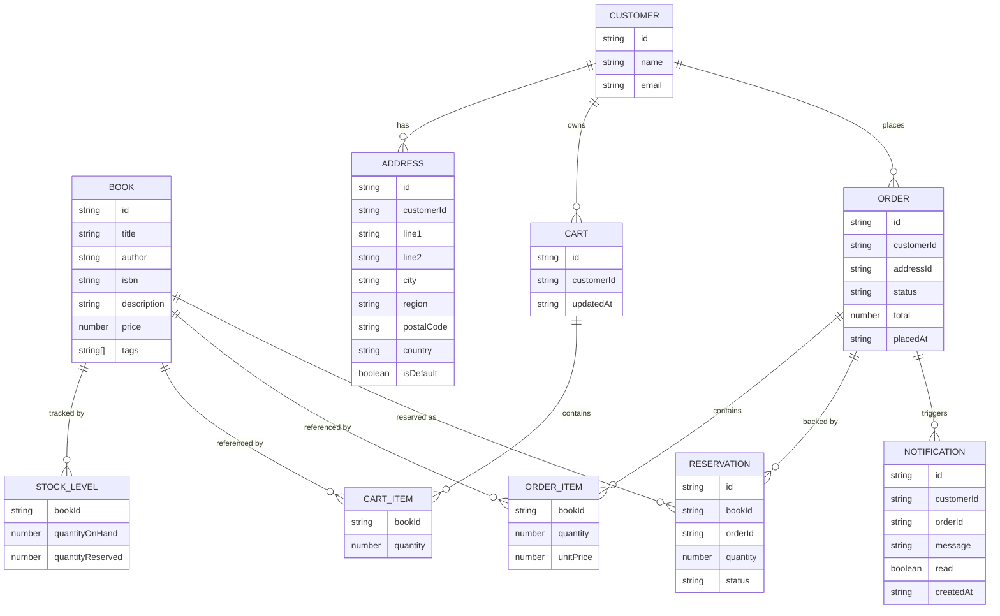

# Domain Model

The bookstore's entities span six services, each owning the rows below that
belong to its own in-memory store; a `*Id` field is a foreign key held by the
owning service but resolved by calling the service that actually owns it.

- **catalog-service** owns `BOOK`.
- **inventory-service** owns `STOCK_LEVEL` and `RESERVATION`.
- **customers-service** owns `CUSTOMER` and `ADDRESS`.
- **cart-service** owns `CART`/`CART_ITEM`, one cart per signed-in customer.
- **orders-service** owns `ORDER`/`ORDER_ITEM`, created from a cart at checkout.
- **notifications-service** owns `NOTIFICATION`, one row per order status change.

