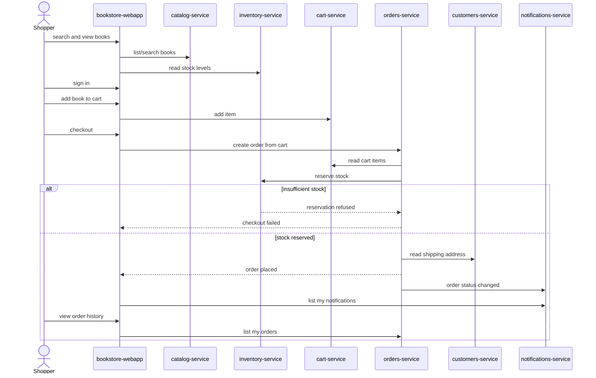

# Browse and purchase

A Shopper browses the catalog as a guest, signs in to check out, and tracks the
resulting order through its notifications.

```mermaid
sequenceDiagram
    actor Shopper
    participant web as bookstore-webapp
    participant catalog as catalog-service
    participant inventory as inventory-service
    participant cart as cart-service
    participant orders as orders-service
    participant customers as customers-service
    participant notifications as notifications-service

    Shopper->>web: search and view books
    web->>catalog: list/search books
    web->>inventory: read stock levels
    Shopper->>web: sign in
    Shopper->>web: add book to cart
    web->>cart: add item
    Shopper->>web: checkout
    web->>orders: create order from cart
    orders->>cart: read cart items
    orders->>inventory: reserve stock
    alt insufficient stock
        inventory-->>orders: reservation refused
        orders-->>web: checkout failed
    else stock reserved
        orders->>customers: read shipping address
        orders-->>web: order placed
        orders->>notifications: order status changed
        web->>notifications: list my notifications
        Shopper->>web: view order history
        web->>orders: list my orders
    end
```

